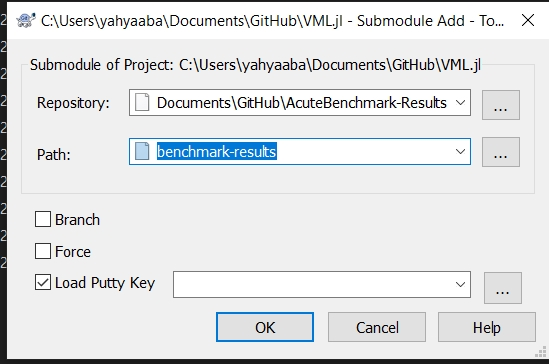
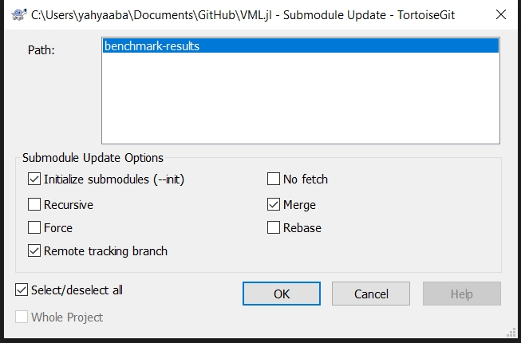

# My Git Commands
My most used git commands for the operations that are not available through GitHub desktop software (https://desktop.github.com/) and [Tortoise git](https://tortoisegit.org/download/)

For github desktop documentation refer to:
https://help.github.com/en/desktop/getting-started-with-github-desktop

# Best practice to use Github for me:
This way you don't need to merge conflicts of pull requests and all that.

* Check out to master

	```git
	git checkout master
	```
* Commit as many as you want using Github Desktop
* Backup your master branch with its several commits

	```git
	git checkout backup
	```
* Check out to master again

	```git
	git checkout master
	```
* squash commits.

	```git
	git rebase --interactive 6c36bcb04f22ad5fda24923bb58eac78ad1f0914
	```
	then
	```git
	git push --force
	```


## Change text editor
For squashing commits you need this. Replace your text editor at least with notepad)
##### For notepad
```
git config --global core.editor notepad
```

##### For notepad++
x64
```git
git config --global core.editor "'C:/Program Files/Notepad++/notepad++.exe' -multiInst -notabbar -nosession -noPlugin"
```
x86
```git
git config --global core.editor "'C:/Program Files (x86)/Notepad++/notepad++.exe' -multiInst -notabbar -nosession -noPlugin"
```
##### For sublime
x64
```git
git config --global core.editor "'C:/Program Files/sublime text 3/subl.exe' -w"
```
x86
```git
git config --global core.editor "'C:/Program Files (x86)/sublime text 3/subl.exe' -w"
```

## Delete a branch
```git
git checkout master
git push --delete origin branch_Name
git branch -D branch_Name
```
## Copy current branch to a new branch
```git
git checkout -b new_Branch_Name
```
## Squash commits (merge)
use the commit ID of one commit before your first commit,
```git
git rebase --interactive 0ca4f4376f04eee6599a4b2e17255357fb888422
```
When editor is opened,
replace pick which squash,
make the first squash pick again. (All other commits will be merged to this one)
Save and close the first editor,
the second editor will be opened for editing comments.
Use the first line and some enters after that as the title.
Write your comments below that (things after # are ignored)
In the end:
```git
git push --force
```
Alternative method with number (not much useful)
```git
git rebase --interactive HEAD~[53]
```
## Reword last commit's comment
```git
git commit --amend -m "title" -m "

Your comment here
use enter for different lines

"
```
```git
git push --force
```
## Merge branch to master
```git
git checkout master
git merge other_Branch
git push --force
```
## Remove last commit
use the id one before that
```git
git reset --hard e78df3ad58a71eca510a76b716404841d6d4fe20
git push --force
```
or
```git
git reset --hard HEAD^
git push origin -f
```

## Rename branch:
```
git checkout old_name
git branch -m new_name
git push origin --delete old_name
git push origin -u new_name
```

## Rename a file:
Open the git bash in the folder that file exits (hold shift and right click and select open bash here on Windows)
```git
git mv old_filename new_filename
```

## Fork Forced Sync
```git
git fetch upstream
git reset --hard upstream/master
git push -f
```

## Move commits between branches
```git
git checkout newbranch
git cherry-pick 87ea90d1~1..b4167564
```
or
```git
git cherry-pick d198f1d
```
Don't forget `~1`

## Edit a deep commit
- Save and stash your work so far, like before and commit what you have without amend mode: `git commit -a -m "Foo"`
- From git log copy commit ID (SHA) of the one commit before the old commit onto your clipboard.
- Start the interactive rebase process, pasting in the characters from the ID: 
```
git rebase --interactive ID
```
- Your editor will come up with several lines like `pick d3adb33` Commit message, one line for each commit since the older one.
For the most recent commit, change the word "pick" to "squash" at the start of the line. (This tells Git to combine it back into the one before it.)
- Use your editor to reorder the lines, putting the line for the most recent commit just after the older commit you want to fix.
Save and quit your editor.
- The editor will come up again, this time asking you for the commit message for the combined commit. Delete or comment out the newer, temp message ("Foo").
- Save and quit your editor, and:
```
git push --force
```

## Sub-modules

### Add a submodule to a repository

Right-Click, Add Sub-module, then:



or using git commands
```
git submodule add git@github.com:url_to/awesome_submodule.git path_to_submodule
```

### Download (Initialize) the submodule:
Right-Click, Update Sub-module, then:


or using git commands:
```git
git submodule update --init --recursive
```

### Update the submodule (if that repository changes):

Right-Click, Update Sub-module, then:


or using git commands:
```git
git submodule update --remote --merge
```

### Remove trailing whitespace
Git solution:
```git
git grep -I --name-only -z -e '' | xargs -0 sed -i 's/[ \t]\+\(\r\?\)$/\1/'
```

Generic solution:
```ps
while IFS= read -r -d '' -u 9
do
    if [[ "$(file -bs --mime-type -- "$REPLY")" = text/* ]]
    then
        sed -i 's/[ \t]\+\(\r\?\)$/\1/' -- "$REPLY"
    else
        echo "Skipping $REPLY" >&2
    fi
done 9< <(find . -type f -print0)
```